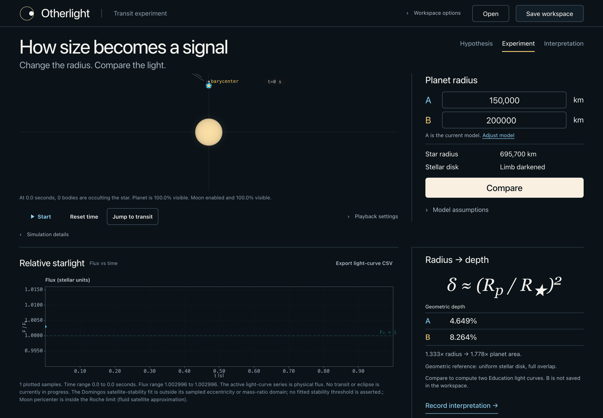
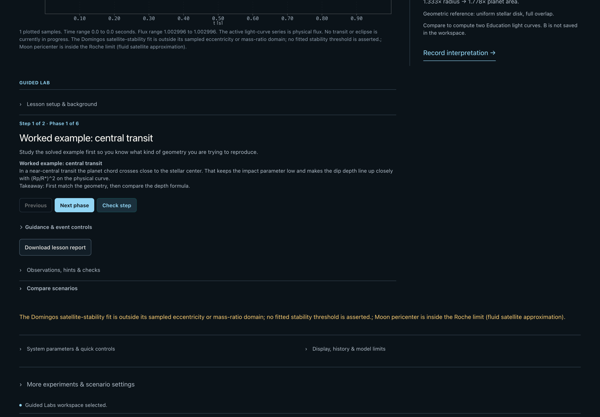
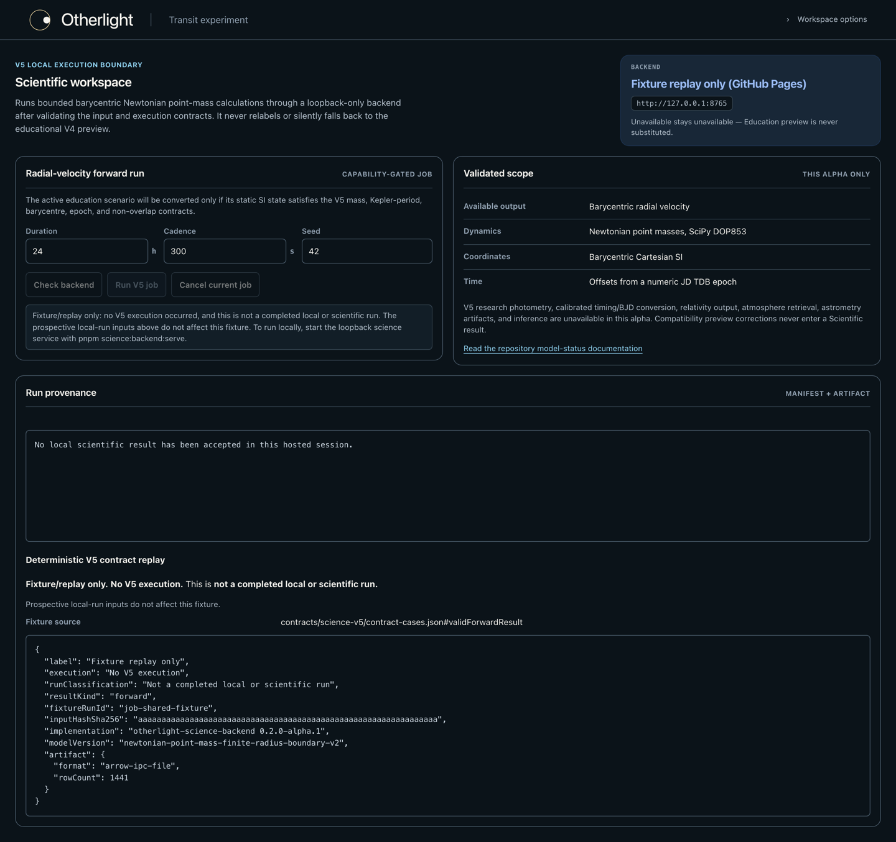

<div align="center">

# Otherlight

**Exoplanet and binary-star labs you can run in a browser tab.**

Change a planet's radius, watch the light curve answer back, then step up to a
strictly validated radial-velocity model when you want numbers you can inspect.

[Live app](https://sebastianspicker.github.io/otherlight/) ·
[Screenshot tour](https://sebastianspicker.github.io/otherlight/demo/) ·
[Documentation](docs/README.md) ·
[Contributing](CONTRIBUTING.md)

[](https://github.com/sebastianspicker/otherlight/actions/workflows/ci.yml)
[](LICENSE)
[](RELEASE_STATUS.md)

</div>

Otherlight is a local-first workspace for learning about exoplanet transits,
exomoons, detached binaries, photometry, and timing. It began as a teaching
tool and grew a strict scientific lane alongside it, so the same scenario can be
read as an intuitive picture and, where supported, as a numerical result.

The primary product is the **Browser** app: a TypeScript/Vite modular monolith
that runs the Education simulation entirely on your machine, with no account, no
upload, and no service required. A separate **loopback Python service** can run
one strictly validated Newtonian radial-velocity model (the "V5" contract) when
you explicitly ask for it.

The project is pre-release. Two things stay deliberately separated, and the
interface labels them differently everywhere:

- an **Education preview** — a teaching model with stated limits;
- a **scientific execution result** — output from the validated model, or a
  clearly labelled replay of a checked-in fixture.

A green test suite does not turn the first into the second. The authoritative
status lives in
[`contracts/capabilities-v1/manifest.json`](contracts/capabilities-v1/manifest.json)
and [`docs/physics/model-status.md`](docs/physics/model-status.md).

## Screenshot tour

All three frames are captures of the Pages build that ships from `main`, so they
match what you can click through yourself.

**1 · Education — connect geometry to a light curve.** Change the planet radius
and watch the transit depth follow. Sky view, light curve, and the depth formula
stay in step, so the arithmetic is visible next to the picture.



**2 · Guided Lab — move from prediction to evidence.** Lessons advance one phase
at a time, keeping the prompt, the evidence, and a learner's written responses
together so a session can be resumed later.



**3 · Scientific — keep the execution boundary explicit.** The Scientific
profile validates inputs and shows run provenance. On the hosted build it
replays a checked-in result fixture; a real run requires the loopback service on
your own machine.



## Try it

**Hosted builds.** The [live app](https://sebastianspicker.github.io/otherlight/)
runs the Education simulation in your browser and shows the Scientific profile as
a labelled fixture replay — it never contacts a service. The
[screenshot tour](https://sebastianspicker.github.io/otherlight/demo/) is the
same three frames above, as a standalone page.

**Run it locally.** Requires Node 22.13 or later and pnpm 11.4. From the
repository root:

```bash
corepack enable
corepack install
pnpm install --frozen-lockfile
pnpm dev
```

Open the Vite URL printed in the terminal. Education runs entirely in the
browser and needs no service. To check the production bundle:

```bash
pnpm build
pnpm preview
```

## What's in the box

| Path                                     | What it is                                                                               | Runtime                 | Guide                                                      |
| ---------------------------------------- | ---------------------------------------------------------------------------------------- | ----------------------- | ---------------------------------------------------------- |
| `apps/browser/`                          | Primary app: Education simulation, Guided Labs, plots, exports, `.otherlight` workspaces | TypeScript, Vite        | [Browser](apps/browser/README.md)                          |
| `apps/apple/`                            | SwiftUI Education app plus a macOS host with a native scientific runtime                 | Swift 6.3.3, Xcode 26.6 | [Apple](apps/apple/README.md)                              |
| `apps/apple/Packages/OtherlightCore/`    | Portable Education, visualization, and contract libraries                                | SwiftPM                 | [Package](apps/apple/Packages/OtherlightCore/README.md)    |
| `apps/apple/Packages/OtherlightScience/` | Experimental macOS DOP853 and Arrow runtime                                              | SwiftPM                 | [Package](apps/apple/Packages/OtherlightScience/README.md) |
| `services/science/`                      | Optional loopback radial-velocity service                                                | Python 3.14             | [Service](services/science/README.md)                      |
| `apps/demo/`                             | Static screenshot tour                                                                   | HTML, CSS, JavaScript   | [Tour](apps/demo/README.md)                                |
| `contracts/`                             | Versioned cross-language schemas, fixtures, and the capability registry                  | JSON                    | [Architecture](docs/ARCHITECTURE.md)                       |

This is one pnpm project, not a JavaScript package monorepo, and the Browser is
a modular monolith rather than a set of published packages. See
[Architecture](docs/ARCHITECTURE.md) for dependency directions, data flows,
persistence, and non-goals.

## The loopback science service

The service is optional and stays on your machine. It binds only to
`127.0.0.1:8765`, has no authentication, tenancy, or remote deployment model,
and refuses non-loopback requests. It requires Python 3.14.6 or a later 3.14
patch.

```bash
python3.14 -m venv services/science/.venv
source services/science/.venv/bin/activate
python -m pip install -e './services/science[dev]'
pnpm science:backend:serve
```

Supported output today is barycentric radial velocity only. Photometry,
time-scale conversion, relativity, atmosphere retrieval, and inference are not
implemented. The [service guide](services/science/README.md) covers routes,
capability gating, limits, cache behavior, and error semantics.

## Verifying changes

The ordinary Browser gate is:

```bash
pnpm contracts:check
pnpm ci:verify
```

`ci:verify` runs the public-surface and documentation hygiene checks, the Browser
architecture and physics-registry checks, lint and format checks, TypeScript 7
and TypeScript 6 compatibility, tests, and the production build.
`contracts:check` is a separate command in the CI workflow.

Run the independent lane when its code or contracts change:

```bash
pnpm science:backend:check
pnpm science:backend:test
pnpm native:core:test
pnpm native:science:test
pnpm smoke:pages
```

Exact CI lanes, Apple packaging, and maintenance commands live in
[Continuous integration](docs/ci.md), the [operations runbook](docs/RUNBOOK.md),
and the component guides.

## Documentation

- [Documentation map](docs/README.md)
- [Architecture](docs/ARCHITECTURE.md)
- [Product](docs/PRODUCT.md)
- [Design system](docs/DESIGN.md)
- [Operations](docs/RUNBOOK.md)
- [Physics model status](docs/physics/model-status.md)
- [Contributing](CONTRIBUTING.md)
- [Security policy](SECURITY.md)
- [Release status](RELEASE_STATUS.md)

Otherlight is licensed under [MIT](LICENSE). Third-party attribution notes are
in [THIRD_PARTY_NOTICES.md](THIRD_PARTY_NOTICES.md).
