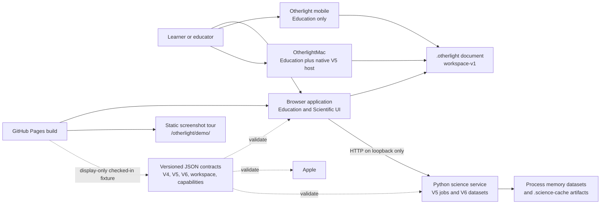
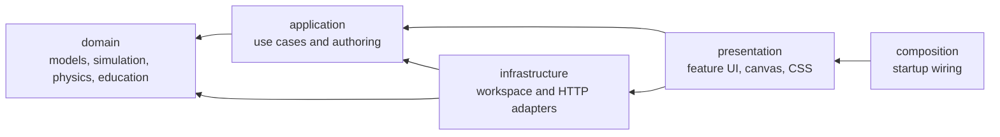

# Architecture

Otherlight is one repository and one pnpm project — not a JavaScript package
monorepo. It combines a primary Browser application, a SwiftUI Education app, an
optional local scientific service, a static screenshot tour, and a set of
explicit cross-language contracts.

## System context



The Browser and both Apple targets run Education calculations locally. The
Browser can also submit a supported scenario to the Python service, but only
through the strict loopback client and only after a compatible capability
response. The mobile app neither links nor calls the scientific runtime.
`OtherlightMac` links the V5 native package and Arrow: its Scientific profile
compiles accepted V4 authoring into strict V5, runs one cancellable session-only
job off the main actor, and exposes separate, explicit Arrow and manifest
exports.

`apps/demo/` is a separate static screenshot tour that does not execute the
simulation. The Pages workflow publishes it at `/otherlight/demo/`, beside the
live app at `/otherlight/`.

## Components and ownership

| Component                                | Responsibility                                                                                                   | Build or runtime boundary                             |
| ---------------------------------------- | ---------------------------------------------------------------------------------------------------------------- | ----------------------------------------------------- |
| `apps/browser/`                          | Scenario authoring, Education runtime, Guided Labs, visualization, workspace handling, and Scientific-profile UI | One Vite bundle in `dist/`                            |
| `apps/apple/`                            | Shared SwiftUI Education sources, mobile app, and macOS native V5 host                                           | Isolated mobile and macOS Xcode project graphs        |
| `apps/apple/Packages/OtherlightCore/`    | Portable models, Education, visualization, strict V5 contracts and authoring, and benchmark                      | Independent SwiftPM package                           |
| `apps/apple/Packages/OtherlightScience/` | Experimental macOS DOP853 execution and Arrow IPC writing                                                        | Independent SwiftPM package; Mac target only          |
| `services/science/`                      | Strict V5 jobs plus bounded V6 process-memory dataset imports                                                    | Installable Python package and loopback process       |
| `contracts/`                             | Schemas, shared fixtures, and platform capability evidence                                                       | Serialized compatibility boundary                     |
| `apps/demo/`                             | Non-executing static screenshot tour                                                                             | Copied into the Pages artifact at `/otherlight/demo/` |

## Browser modular monolith

The Browser has one build and explicit source layers. Arrows point from a consumer
to a dependency:



`domain/` cannot import browser APIs or any outer layer; `application/` cannot
import infrastructure, presentation, or composition; infrastructure cannot import
presentation or composition; and `composition/` is the only startup wiring layer.
Inside presentation, `render/` may import only `domain/` and `render/`, so canvas
drawing stays a pure projection of simulation output.
`scripts/check-architecture.mjs` enforces these imports and rejects relative
TypeScript cycles.

### Where new Browser code belongs

| Folder under `apps/browser/src/`       | Owns                                                                                    |
| -------------------------------------- | --------------------------------------------------------------------------------------- |
| `domain/model/`                        | Authoring types, units, labs catalog, and model invariants                              |
| `domain/simulation/v4/`                | The Education V4 runtime; `index.ts` is its public surface                              |
| `domain/orbits/`, `domain/photometry/` | Orbital mechanics and photometric models registered in `docs/physics/`                  |
| `domain/education/`                    | Guided Lab lessons, learning state, signals, and reports                                |
| `application/catalog/`                 | Checked-in defaults, presets, real-system snapshot, and binary-lab defaults             |
| `application/runtime/`                 | Runtime factory and lifecycle, histories, chromatic sampling, and lesson signals        |
| `application/*.ts`                     | The V4 authoring boundary, product view state, and deployment-mode facts                |
| `infrastructure/`                      | Workspace documents, the loopback V5/V6 clients, and the chromatic worker adapter       |
| `presentation/shell/`                  | Page shell, header, product and profile navigation, DOM refs, and the error boundary    |
| `presentation/scenario/`               | Parameter form, validation, presets and catalog source, apply/reset, dirty guard        |
| `presentation/playback/`               | Frame loop, live light curve and scene building, view controls, chromatic overlay       |
| `presentation/timing/`                 | Transit-timing (O-C) panel and plot                                                     |
| `presentation/labs/`                   | Guided Lab views, lesson navigation, and learner responses                              |
| `presentation/observatory/`            | The A/B radius comparison surface                                                       |
| `presentation/science/`                | Scientific profile: V5 jobs, V6 datasets, and the Pages contract replay                 |
| `presentation/workspace/`              | `.otherlight` save/open, restoration, and URL history                                   |
| `presentation/render/`                 | Canvas primitives (`canvas/`), sky scene (`sky/`), and light-curve plot (`lightCurve/`) |
| `composition/`                         | `bootstrap.ts`, app state, startup, and the chromatic worker entry                      |

A presentation feature owns its controllers and its `templates/`. Features may
call one another's exported functions where a workflow crosses them (scenario
application resets lab and playback state, for example), but file-level import
cycles are rejected. The real-system snapshot path
`application/catalog/real-systems.snapshot.json` is shared with the Apple
projects, CI path filters, and the refresh script, so it does not move.

`apps/browser/index.html` loads `src/main.ts`, which renders the shell and
dynamically loads `src/composition/bootstrap.ts`. The composition root creates the
V4 runtime and wires the presentation features to application and infrastructure
ports. A second composition entry, `chromatic.worker.ts`, runs canonical Education
band sampling in a module worker: the application owns the pure sampler and the
bounded queue, infrastructure owns the worker adapter, and presentation owns the
colors, overlays, and overlay-specific status message.

Configurations cross the worker boundary once per scenario generation. Dynamic
requests start at most every 100 ms, with one active and one replaceable pending
request, and completed current-generation results publish even while newer work is
pending. Hidden tabs and disposal terminate worker work; showing a tab rebuilds
that generation's runtimes and resumes its requested overlay.

Fixed previews cache successful 256-point sampling using runtime identity and
mode, plot mode, display scale, measurement settings, noise seed, and the
invalidation generation. Reset, seek, and clear invalidate that metadata, while
Undo restores matching metadata and comparison range. Failed previews stay
invalid. Worker failures leave the primary simulation available and retain the
last valid same-scenario chromatic overlay.

## Principal data flows

### Education

```text
controls and presets
  -> BrowserScenarioDraft
  -> EducationScenarioV4
  -> V4 Education runtime
  -> frames, plots, diagnostics, Guided Labs, and exports
```

`BrowserScenarioDraft` is mutable authoring state. The pure draft-to-V4 mapping
lives in the domain (`domain/simulation/v4/migrateModels.ts`). Outside the domain,
drafts become a serializable `EducationScenarioV4` only through
`apps/browser/src/application/browserScenarioAdapter.ts`: `toEducationScenarioV4`
for runtime ingress (with scientific-browser validation and runtime mode) and
`toPreviewScenarioV4` for side previews such as chromatic bands and observatory
comparisons. An ESLint rule rejects direct use of the domain mapping from the
outer layers. Education output stays a teaching preview
within the model registry's stated limits. The draft holds model authoring values,
not DOM state or a cross-language wire format.

### Scientific execution and hosted replay

```text
BrowserScenarioDraft -> EducationScenarioV4 -> strict V5 ForwardRunRequest
  -> loopback capability check -> asynchronous job -> result + run manifest
  -> optional content-addressed Arrow IPC artifact
```

`apps/browser/src/infrastructure/science/educationScenarioCompiler.ts` accepts
only the supported static V4 subset and emits barycentric SI state; unsupported
dynamics, fields, and fidelity modes fail closed. The client accepts only HTTP URLs
on `127.0.0.1` or `localhost`, validates responses, and bounds polling.

The GitHub Pages build has no loopback origin in its Content Security Policy and
never creates a science client request. Its Scientific view validates and projects
`contracts/science-v5/contract-cases.json#validForwardResult` as a display-only
contract replay. The current form inputs do not alter that fixture, and the replay
is neither a local run nor a scientific result.

### Workspaces

`workspace-v1` stores product context, an accepted Education V4 scenario, bounded
Guided Lab progress, and an optional validated V5 request. It omits draft text,
playback state, histories, live jobs, results, and artifacts. Readers validate the
complete document before replacing active state, and each boundary converts V4
back to Browser or Apple authoring state on the way in.

### V6 dataset imports

```text
bounded raw UTF-8 JSON -> duplicate-safe parse -> exact V6 family validation
  -> canonical JSON SHA-256 identity -> duplicate check -> freeze and size
  -> atomic quota admission
```

The `/v2` family currently exposes capability discovery and dataset CRUD only.
Imports do not accept paths, URLs, filenames, multipart bodies, archives, Arrow,
or compressed content. The job and artifact descriptor schemas establish a future
boundary, but no V6 job is accepted or advertised.

## State and persistence

- Browser session state and simulation histories live in memory.
- `.otherlight` files are user-selected portable documents; the legacy
  `.transitlab` extension stays import-compatible with the same payload.
- The science service keeps job state in process memory and retains at most the
  newest 128 terminal records by default.
- Imported V6 datasets live only in process memory and clear at shutdown. They are
  bounded by count, samples, source bytes, and retained normalized memory.
- Science artifacts are content-addressed files in `.science-cache` relative to
  the service process, and they are not embedded in workspaces. A default 1 GiB
  retained-cache quota stops publication without deleting existing artifacts,
  while active temporary output has a separate 64 MiB per-writer bound. An OS
  advisory ownership lock excludes competing writers and offline cleanup. The local
  operator CLI reports usage and removes only explicitly selected entries; there is
  no automatic expiry or backup.
- The Apple app keeps current workspace context in local preferences and uses
  sandboxed user-selected file access.

Default Python and native Swift V5 publication retain time and RV samples plus
manifest metadata. Both share propagation and collision certification with their
public rich/full-state paths, so compact collection changes retention, not the
integrator or the serialized output.

There is no database, account service, cloud synchronization, or shared
server-side state.

## Contracts and cross-runtime dependencies

- `contracts/education-v4/` owns canonical Education scenarios and parity fixtures.
- `contracts/science-v5/` owns strict requests, run manifests, canonical JSON
  cases, and shared service/client fixtures.
- `contracts/science-v6/` owns strict dataset imports and the additive timing
  request, job, artifact, and provenance V3 shapes. Timing remains a contract, not
  an available execution path, and V6 does not revise V5.
- `contracts/workspace-v1/` owns `.otherlight` documents.
- `contracts/capabilities-v1/manifest.json` is the platform capability and
  automated-evidence registry.

TypeScript, Python, and Swift validate these shapes independently: they share no
implementation code and never infer one another's data structures. An intentional
serialized change must update the schema, fixtures, validators, consumers, and
compatibility evidence together.

The Apple app bundles the Browser-owned checked-in real-system snapshot, and the
portable Swift package reads checked-in Education and V5 fixtures for parity. Those
are explicit data dependencies, not runtime service calls.

## External and security boundaries

The normal Browser build carries strict clients for the local V5 endpoint and the
V6 dataset lifecycle. Its local-only Scientific profile exposes bounded dataset
import, listing, metadata, and deletion; Pages omits that surface. The Python
service requires loopback Host values and rejects unapproved browser Origins, but
it has no authentication, authorization, tenancy, TLS, or supported remote
deployment. Those checks do not isolate mutually hostile same-user local
processes.

Neither Apple target has a runtime network client or an outbound-network
entitlement. `OtherlightMac` alone resolves and links the pinned Arrow-backed
science package, and mobile dependency checks reject it. The maintainer-triggered
real-system catalog refresh reads NASA TAP and rewrites a checked-in snapshot;
normal Browser, Apple, and service operation never fetches that catalog.

## Build and deployment boundaries

- `pnpm build` creates the ordinary Browser bundle in `dist/` with the
  loopback-only science allowance.
- `pnpm build:pages` creates the `/otherlight/` Pages variant with V5 requests
  disabled. The Pages workflow is the only automated publication path.
- `pnpm build:pages:site` builds that variant and copies the static tour to
  `dist/demo/`, which the workflow publishes as `/otherlight/demo/`.
- `pnpm build:demo` builds the tour on its own into `pages-dist/` for local review.
- The Python package can be built as a wheel, but no remote service deployment is
  defined.
- Apple CI builds and tests unsigned artifacts. Developer ID signing,
  notarization, and release verification are explicit manual operations.

## Invariants and non-goals

- Education results never substitute for a missing V5 result.
- A fixture replay never claims runtime execution.
- Unknown contract versions and fields fail closed.
- The science service stays loopback-only until a separate authenticated
  deployment design exists.
- V5 currently produces radial velocity only; it does not provide photometry,
  astrometry, inference, relativity, time-scale conversion, impacts, or remote
  execution.
- V6 currently imports datasets only. Its job and result schemas are neither
  scientific execution nor availability evidence.
- Browser layer separation does not imply separately published packages.
- The static tour and screenshots are presentation evidence, not runtime proof.

For the operational and scientific details, see the
[operations runbook](RUNBOOK.md), [validation boundaries](validation.md), and
[physics overview](physics/overview.md).

## Decision records and planned boundaries

Accepted architectural direction is recorded separately from current
implementation:

- [ADR 0001](decisions/0001-apple-target-split.md) defines the implemented split
  between portable mobile Education and a macOS-only scientific host.
- [ADR 0002](decisions/0002-science-v6-boundary.md) keeps V5 frozen and makes V6 an
  additive contract and route family.
- [ADR 0003](decisions/0003-v6-transit-timing.md) fixes the dense-trajectory event
  geometry, ephemeris, numerical, and artifact boundaries for timing.

The V6 dataset portion of ADR 0002 is now implemented in the Python service and
Browser product surface; its job, model, and Swift portions remain pending. The
ADR 0001 target split, the portable V5 authoring compiler, the session
coordinator, and the explicit Mac exports are implemented. Live Mac visual and
accessibility review and the mobile archive gate remain before the scientific
boundary can be presented as available.
